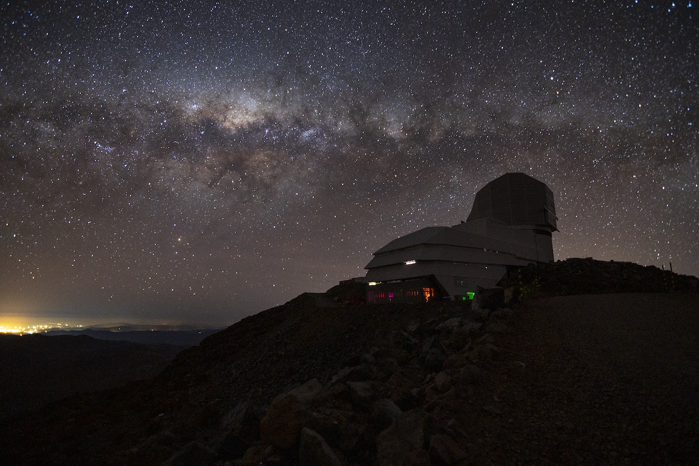

****************************************************
ASTR 597A: Astronomy with Rubin Observatory and LSST
****************************************************

.. toctree::
   :hidden:
   :maxdepth: 2
   :caption: Contents:

   enrollment
   schedule
   assignments
   finalproject
   rsp
   resources

Instructors
===========
`Eric Bellm`_ & `Zeljko Ivezic`_ with the UW Rubin team

.. _`Eric Bellm`: https://faculty.washington.edu/ecbellm/

.. _`Zeljko Ivezic`: https://faculty.washington.edu/ivezic/

Course Information
==================

Winter Quarter 2023

Class meetings: Tues/Thurs 10:00-11:20am in PAA 210 and on Zoom

Course Description 
==================

The Vera C. Rubin Observatory will begin its Legacy Survey of Space and Time (LSST) in 2024 following a commissioning period.  
The LSST will conduct an unprecedented wide, fast, and deep survey of the Southern Hemisphere sky. 
By generating 60 petabytes of imaging data and time-resolved
measurements for 40 billion objects, the LSST will enable groundbreaking new discoveries in cosmology, time-domain astrophysics, solar system science, and Galactic structure.  In this course you will prepare to make some of these discoveries yourself!  We will study the capabilities of the Rubin Observatory and the details of its surveys and data products before digging deeply into specific scientific opportunities.  Students will have the opportunity to prepare analyses and draft papers and proposals in anticipation of forthcoming Rubin data.
